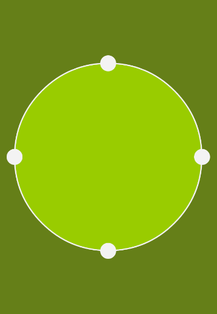

# 可缩放高亮区域
使用场景:图片剪裁,地图电子围栏等

#### 引用
````
    compile 'cn.mindstack:android-resize:2.0'
````
## 截图
 

## 备注 
根据[GoogleAndroid文档](http://developer.android.com/intl/zh-cn/guide/topics/graphics/hardware-accel.html#unsupported) Canvas.clipPath() 不是在所有版本的API中都支持,类库中的解决方式是将硬件加速关闭
````
public HighlightView(View context) {
    ...
    // clipPath with hardware acceleration is only supported in API level 18 and higher,
    // on API levels from 11 to 17 it needs to be turned off.
    // @sse http://developer.android.com/intl/zh-cn/guide/topics/graphics/hardware-accel.html#unsupported
    if (Build.VERSION.SDK_INT < Build.VERSION_CODES.JELLY_BEAN_MR2
            && Build.VERSION.SDK_INT >= Build.VERSION_CODES.HONEYCOMB) {
        // Disable LAYER_TYPE_SOFTWARE, if 11=<Android Version< 18,
        context.setLayerType(context.LAYER_TYPE_SOFTWARE, null);
    }
    ....
}
````
